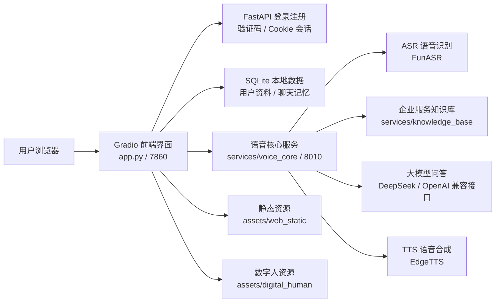

# 小乐语音通话台项目说明文档

## 1. 项目概述

小乐语音通话台是一个融合数字人前端、语音问答后端、企业知识库问答和用户隔离能力的智能语音助手项目。系统支持文字对话、录音上传、连续语音通话、ASR 语音识别、LLM 问答、TTS 语音合成、角色切换、用户注册登录、用户头像与资料设置、账号级聊天记忆隔离。

当前项目以 `app.py` 作为前端与应用入口，通过 Gradio 构建可视化界面，并挂载 FastAPI 登录、注册、静态资源和接口路由。核心语音问答服务位于 `services/voice_core/fastapi_app.py`，默认运行在 `8010` 端口。

## 2. 主要功能

| 功能模块 | 说明 |
|---|---|
| 用户注册登录 | 支持账号注册、登录、图形验证码校验 |
| 单账号单会话 | 同一账号新登录会使旧登录态失效，防止多人共用同一账号 |
| 用户资料 | 支持头像、昵称、性别、生日设置 |
| 用户记忆隔离 | 每个账号拥有独立聊天历史和记忆数据 |
| 角色切换 | 支持小乐、名取同学、胡桃小朋友三个角色 |
| 数字人预览 | 中间区域显示 Live2D / 数字人角色预览 |
| 文字对话 | 用户可直接输入文字并获得回复 |
| 录音上传 | 支持麦克风录制或上传音频，走 ASR/问答/TTS 链路 |
| 连续通话 | 拨打后进入连续监听模式，说话结束后自动提交处理 |
| 麦克风电平 | 前端显示麦克风输入电平，便于排查麦克风问题 |
| 知识库问答 | 支持 IT、HR、行政、财务类企业服务知识库问答 |
| 语音播报 | 支持文字输入后由角色语音播报回答，并可跳过语音 |

## 3. 系统结构



## 4. 目录说明

| 路径 | 说明 |
|---|---|
| `app.py` | Gradio 前端、FastAPI 登录注册、用户资料、记忆隔离和页面逻辑 |
| `services/voice_core/fastapi_app.py` | 语音核心 FastAPI 服务入口 |
| `services/voice_core/config.yaml` | 语音核心配置，包括 ASR、LLM、TTS 等模块 |
| `services/knowledge_base/enterprise_service_desk_knowledge_base.json` | 企业服务知识库数据 |
| `assets/web_static/avatars/` | 系统角色头像资源 |
| `assets/web_static/user_avatars/` | 用户上传头像目录，运行时生成，不上传 GitHub |
| `assets/digital_human/` | 数字人 / Live2D 角色预览资源 |
| `docs/` | 项目说明、部署接口文档和测试记录 |
| `scripts/` | 本地验证脚本 |
| `xiaole_users.sqlite3` | 本地用户数据库，运行时生成，不上传 GitHub |

## 5. 数据存储

系统使用本地 SQLite 数据库 `xiaole_users.sqlite3` 保存运行数据。

| 数据表 | 说明 |
|---|---|
| `users` | 用户账号、密码哈希、当前有效会话 |
| `captcha_challenges` | 图形验证码挑战记录 |
| `user_profiles` | 用户昵称、性别、生日、头像路径 |
| `user_memory` | 用户聊天记忆，按账号和角色隔离 |

密码不会明文保存，使用 PBKDF2-HMAC-SHA256 加盐哈希。`.env`、数据库文件、日志、模型文件和上传头像目录不应上传到 GitHub。

## 6. 服务地址

| 服务 | 地址 | 说明 |
|---|---|---|
| 前端页面 | `http://127.0.0.1:7860` | 小乐语音通话台 |
| 后端健康检查 | `http://127.0.0.1:8010/health` | 检查语音核心服务状态 |
| 问答接口 | `http://127.0.0.1:8010/ask` | 文本/语音问答接口 |
| TTS 接口 | `http://127.0.0.1:8010/tts` | 文本转语音接口 |

## 7. 启动方式

后端语音核心服务：

```powershell
conda activate xiaozhi-voice-core
cd "D:\桌面\zuoye\pbl作业\services\voice_core"
python -m uvicorn fastapi_app:app --host 127.0.0.1 --port 8010
```

前端应用服务：

```powershell
cd "D:\桌面\zuoye\pbl作业"
python app.py
```

启动后访问：

```text
http://127.0.0.1:7860
```

## 8. 使用流程

1. 打开 `http://127.0.0.1:7860`。
2. 注册或登录小乐账号。
3. 在用户设置中填写头像、昵称、性别、生日。
4. 选择角色：小乐、名取同学或胡桃小朋友。
5. 可通过文字输入、录音上传或拨打连续通话进行问答。
6. 企业服务类问题会优先走知识库回答。
7. 同一账号再次登录时会保留自己的聊天记忆，不同账号之间互不共享。

## 9. 注意事项

- 上传 GitHub 前不要提交 `.env`、`xiaole_users.sqlite3`、日志、模型文件和用户头像运行目录。
- 如果页面样式没有更新，先刷新浏览器或重新登录。
- 如果语音识别失败，先检查麦克风权限和麦克风电平条是否有输入。
- 如果问答很慢，优先检查后端日志、大模型接口延迟和 TTS 生成时间。
- 如果后端不可用，前端可能会显示本地兜底回复或错误提示。
