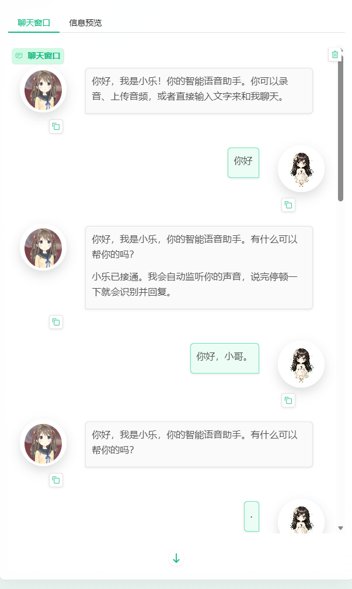
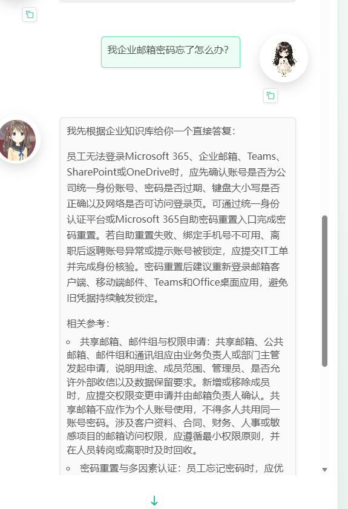
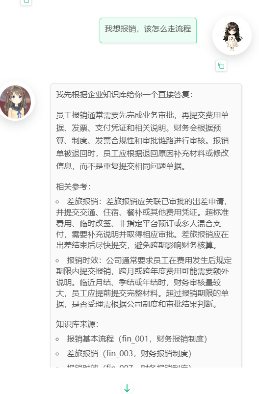

# 小乐语音通话台测试记录

本文档用于记录系统实际运行截图及对应说明，不是测试用例表。内容重点展示聊天窗口、头像显示、IT 知识库回答和财务知识库回答的效果。

- 记录对象：小乐语音通话台
- 记录内容：基础聊天、IT 知识库问答、财务报销知识库问答

## 截图一：基础聊天与头像显示

**截图解释**

- 用户输入：`你好`、`你好，小哥。`
- 系统返回小乐欢迎语，并展示小乐助手头像和用户头像。聊天窗口中用户消息位于右侧，助手消息位于左侧，说明基础文字对话和头像显示已正常。
- 记录要点：用户头像与助手头像均可显示，聊天消息能够按左右对话形式呈现，页面可保留多轮输入记录。

## 截图二：IT 知识库问答记录

**截图解释**

- 用户输入：`我企业邮箱密码忘了怎么办？`
- 系统根据企业知识库返回 Microsoft 365、企业邮箱、Teams、SharePoint 和 OneDrive 等相关账号的排查与重置建议。回答中包含账号状态核对、自助密码重置、MFA 手机不可用和 IT 工单处理等内容。
- 记录要点：该问题能够命中 IT 类知识库，回答不是普通闲聊，而是围绕企业邮箱、多因素认证和权限申请等业务场景展开。

## 截图三：财务报销知识库问答记录

**截图解释**

- 用户输入：`我想报销，该怎么走流程。`
- 系统根据财务报销知识库说明报销需要完成业务审批，再提交费用单据、发票、支付凭证和相关说明。回答还覆盖了差旅报销、报销时效和知识库来源。
- 记录要点：该问题能够命中财务知识库，系统返回的内容与报销流程、报销制度和凭证要求相关，可作为财务类问答能力的运行记录。

## 总体说明

- 聊天记录截图显示用户与助手消息可按左右布局展示，并显示对应头像。
- IT 类问题可返回企业邮箱、Microsoft 365、MFA 和 IT 工单处理相关说明。
- 财务类问题可返回报销流程、差旅报销、报销时效和知识库来源等内容。
- 本文档可作为项目演示和验收时的实际运行记录。
