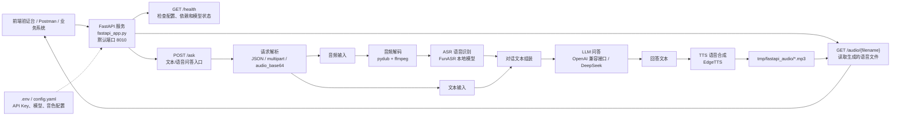

# 小乐语音核心 FastAPI 服务部署指南

本项目是小乐语音助手的核心问答服务，基于 ESP32 语音后端链路提取，并新增了 FastAPI HTTP 接口。它可以提供：

- 文本问答：文本输入，大模型返回文本
- 语音合成：回答文本转 mp3 语音
- 语音识别：上传语音文件识别成文本，再交给大模型回答

当前 FastAPI 服务入口为：

```text
fastapi_app.py
```

默认服务地址：

```text
http://127.0.0.1:8010
```

## 1. 项目结构

```text
services/voice_core/
├─ fastapi_app.py                         # FastAPI 服务入口
├─ requirements-fastapi.txt               # FastAPI 最小运行依赖
├─ .env.example                           # 环境变量示例，不包含真实 key
├─ docs/
│  └─ API接口文档.md                       # 规范接口文档
├─ postman/
│  ├─ Xiaozhi_Voice_Core_API.postman_collection.json
│  └─ Xiaozhi_Voice_Core_API.postman_environment.json
├─ config.yaml                            # 原始语音链路模板配置
├─ data/.config.yaml                      # 本地占位配置
├─ core/                                  # 提取后的核心模块
├─ plugins_func/                          # 工具/插件函数
└─ tmp/                                   # 运行时生成文件
```

### 系统结构图



核心调用链：

```text
客户端 -> POST /ask -> 请求解析 -> ASR(可选) -> LLM -> TTS(可选) -> 返回 answer_text/audio_url
```

更多源码提取说明见：

```text
README_提取说明.md
```

## 2. 环境要求

推荐环境：

| 项目 | 要求 |
| --- | --- |
| 操作系统 | Windows 10/11、Linux、macOS |
| Python | 3.10 或 3.11 |
| 网络 | 需要能访问大模型接口和 EdgeTTS |
| 大模型 | OpenAI 兼容接口，例如 DeepSeek |
| TTS | 默认使用 EdgeTTS |
| ASR | 默认预留 FunASR 本地识别 |

当前已验证文本问答和 EdgeTTS 语音输出可运行。语音输入需要额外安装 FunASR 依赖和模型。

## 3. 安装依赖

进入项目目录：

```powershell
cd D:\桌面\zuoye\pbl作业\services\voice_core
```

安装 FastAPI 服务依赖：

```powershell
python -m pip install -r requirements-fastapi.txt
```

如果需要语音输入，也安装 ASR 依赖：

```powershell
python -m pip install funasr modelscope
```

如果要上传 `mp3`、`m4a`、`webm` 等格式音频，需要安装 `ffmpeg`。如果只上传标准 `wav`，通常问题最少。

## 4. 配置环境变量

复制示例文件：

```powershell
Copy-Item .env.example .env
```

编辑 `.env`：

```env
XIAOZHI_LLM_API_KEY=sk-your-key-here
XIAOZHI_LLM_BASE_URL=https://api.deepseek.com
XIAOZHI_LLM_MODEL=deepseek-chat
XIAOZHI_TTS_VOICE=zh-CN-XiaoxiaoNeural
```

也可以继续使用你父目录已有的：

```text
D:\桌面\zuoye\pbl作业\.env
```

服务会兼容这些变量：

| 父目录变量 | 服务内部含义 |
| --- | --- |
| `OPENAI_API_KEY` | 大模型 API Key |
| `OPENAI_BASE_URL` | 大模型接口地址 |
| `MODEL_NAME` | 大模型名称 |

服务读取 `.env` 的优先顺序：

1. `D:\桌面\zuoye\pbl作业\.env`
2. `D:\桌面\zuoye\pbl作业\services\voice_core\.env`


后读取的文件会覆盖占位值，所以当前目录 `.env` 更适合放本服务专用配置。

## 5. 配置 ASR 语音识别

如果只需要文本输入和语音输出，可以跳过本节。

语音输入默认使用 FunASR 本地模型。需要准备模型目录，例如：

```text
models/SenseVoiceSmall
```

也可以在 `.env` 里指定绝对路径：

```env
XIAOZHI_ASR_MODEL_DIR=D:\models\SenseVoiceSmall
```

Windows 下建议把 FunASR 模型放在纯英文路径，避免部分底层模型读取逻辑无法处理中文目录。当前本机已配置为：

```env
XIAOZHI_ASR_MODEL_DIR=C:\Users\DR7\.cache\xiaozhi-models\SenseVoiceSmall
```

启动后可通过 `/health` 查看：

```json
{
  "details": {
    "asr_model_dir": "...",
    "asr_model_dir_exists": true
  }
}
```

如果 `asr_model_dir_exists=false`，语音上传会返回 ASR 模型缺失错误，但文本问答仍可正常使用。

## 6. 启动服务

开发启动：

```powershell
python -m uvicorn fastapi_app:app --host 0.0.0.0 --port 8010
```

如果只允许本机访问：

```powershell
python -m uvicorn fastapi_app:app --host 127.0.0.1 --port 8010
```

启动成功后会看到类似输出：

```text
Uvicorn running on http://0.0.0.0:8010
```

## 7. 验证部署

### 7.1 健康检查

```powershell
Invoke-RestMethod -Uri "http://127.0.0.1:8010/health" -Method Get
```

重点看这些字段：

```json
{
  "ok": true,
  "dependencies": {
    "openai": true,
    "edge_tts": true
  },
  "details": {
    "llm_api_key_configured": true,
    "tts_voice": "zh-CN-XiaoxiaoNeural"
  }
}
```

### 7.2 文本问答

```powershell
$body = @{
  text = "你好，用一句话介绍你自己"
  return_audio = $true
  include_audio_base64 = $false
} | ConvertTo-Json

Invoke-RestMethod `
  -Uri "http://127.0.0.1:8010/ask" `
  -Method Post `
  -ContentType "application/json; charset=utf-8" `
  -Body $body
```

成功返回示例：

```json
{
  "session_id": "1654f7bf94e84c3ba51ee83fe3303ebf",
  "input_text": "你好，用一句话介绍你自己",
  "answer_text": "你好，我是小乐，一个可以进行语音问答的智能助手。",
  "audio_url": "/audio/ask-1654f7bf94e84c3ba51ee83fe3303ebf-e4bf7dd8.mp3",
  "audio_content_type": "audio/mpeg",
  "audio_base64": null,
  "errors": []
}
```

播放语音时，把 `audio_url` 拼到服务地址后面：

```text
http://127.0.0.1:8010/audio/ask-xxx.mp3
```

### 7.3 上传语音问答

语音上传需要先装好 FunASR 和模型。

```powershell
curl.exe -X POST "http://127.0.0.1:8010/ask" `
  -F "audio=@sample.wav" `
  -F "text=请简短回答" `
  -F "return_audio=true"
```

建议优先使用：

- 单声道或普通 `wav`
- 16kHz 或 44.1kHz 都可以，服务会转成 16kHz mono PCM

## 8. Postman 联调

Postman 文件：

```text
postman/Xiaozhi_Voice_Core_API.postman_collection.json
postman/Xiaozhi_Voice_Core_API.postman_environment.json
```

导入步骤：

1. 打开 Postman。
2. 点击 `Import`。
3. 导入 collection 和 environment 两个 JSON 文件。
4. 右上角选择环境 `Xiaole Voice Core Local`。
5. 确认环境变量 `base_url=http://127.0.0.1:8010`。
6. 先运行 `Health Check`。
7. 再运行 `Ask - Text JSON`。

`Ask - Text JSON` 成功后会自动把返回的 `audio_url` 写入环境变量，然后可以调用 `Get Generated Audio` 下载生成的 mp3。

## 9. 接口列表

| 方法 | 路径 | 说明 |
| --- | --- | --- |
| `GET` | `/health` | 健康检查 |
| `POST` | `/ask` | 文本/语音问答 |
| `GET` | `/audio/{filename}` | 获取生成的语音文件 |

完整字段说明见：

```text
docs/API接口文档.md
```

## 10. 部署到局域网或服务器

### 10.1 局域网访问

启动时使用：

```powershell
python -m uvicorn fastapi_app:app --host 0.0.0.0 --port 8010
```

然后在同一局域网设备访问：

```text
http://你的电脑局域网IP:8010
```

Windows 如无法访问，检查防火墙是否放行 Python 或 8010 端口。

### 10.2 服务器部署建议

Linux 服务器可以使用：

```bash
python -m venv .venv
source .venv/bin/activate
pip install -r requirements-fastapi.txt
uvicorn fastapi_app:app --host 0.0.0.0 --port 8010
```

生产环境建议加一层 Nginx 反向代理，并配置 HTTPS。

示例 Nginx 片段：

```nginx
server {
    listen 80;
    server_name your-domain.com;

    location / {
        proxy_pass http://127.0.0.1:8010;
        proxy_set_header Host $host;
        proxy_set_header X-Real-IP $remote_addr;
        proxy_set_header X-Forwarded-For $proxy_add_x_forwarded_for;
        proxy_set_header X-Forwarded-Proto $scheme;
    }
}
```

## 11. 常见问题

### 11.1 `/health` 里 `llm_api_key_configured=false`

说明服务没有读到可用大模型 Key。检查：

- `.env` 是否存在
- 变量名是否为 `XIAOZHI_LLM_API_KEY` 或 `OPENAI_API_KEY`
- Key 是否还是 `sk-your-key-here` 这类占位值

### 11.2 `/ask` 返回 `LLM failed`

常见原因：

- API Key 无效
- `XIAOZHI_LLM_BASE_URL` 不正确
- `XIAOZHI_LLM_MODEL` 不存在或没有权限
- 网络无法访问模型服务

### 11.3 返回文本成功，但 `errors` 里有 `TTS failed`

说明大模型回答成功，但语音合成失败。检查：

- 是否能访问 EdgeTTS 网络服务
- `XIAOZHI_TTS_VOICE` 是否为有效音色
- 文本是否过长

### 11.4 上传音频返回 `ASR failed`

常见原因：

- 没装 `funasr`
- 没有 ASR 模型目录
- `XIAOZHI_ASR_MODEL_DIR` 路径不正确
- 上传格式无法被解码，缺少 `ffmpeg`

### 11.5 Postman 上传文件失败

Postman 的文件字段不会自动读取环境变量里的路径。需要在 `Ask - Audio Multipart` 请求中，手动点击 `audio` 字段右侧选择本地文件。

## 12. 安全说明

- 不要把真实 API Key 写进 Git 或 Postman Collection。
- `.env.example` 只能放占位值。
- 当前服务未启用鉴权，如果部署到公网，建议至少加网关鉴权或 Nginx Basic Auth。
- 生成的音频文件保存在 `tmp/fastapi_audio`，如长期运行可定期清理。
